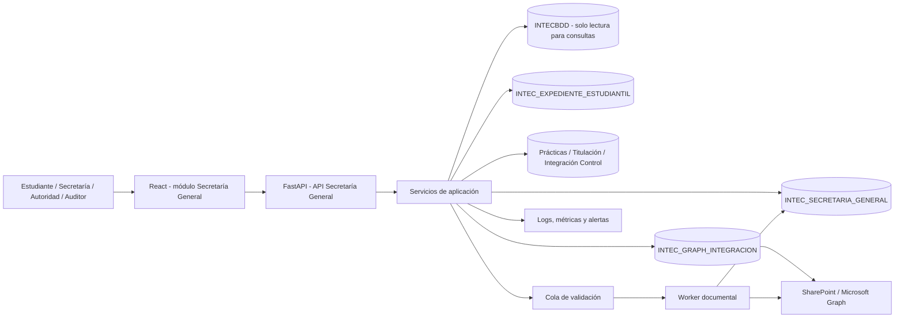
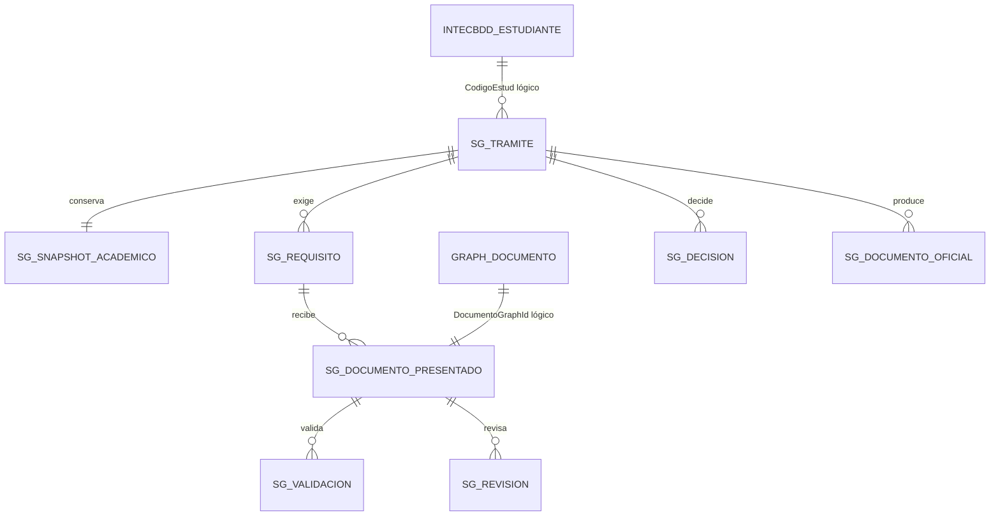

# Arquitectura del módulo de Secretaría General

**Estado:** Propuesta técnica para aprobación

**Fecha:** 2026-09-08

**Base propuesta:** `INTEC_SECRETARIA_GENERAL`

**Alcance:** trámites de Secretaría, verificación documental, emisión, firma, entrega y trazabilidad.

## 1. Decisión de arquitectura

Se recomienda crear `INTEC_SECRETARIA_GENERAL` como una base complementaria y transaccional. Su responsabilidad será administrar el ciclo de vida de los trámites y conservar la evidencia de cada verificación realizada por Secretaría.

La nueva base **no debe copiar ni sustituir** los datos maestros que ya pertenecen a otras bases:

| Dato o proceso | Fuente de verdad |
| --- | --- |
| Persona, estudiante, carrera, período, matrícula, pensum y notas | `INTECBDD` |
| Expediente documental estudiantil de dominio | `INTEC_EXPEDIENTE_ESTUDIANTIL` |
| Archivo físico, ubicación, versión y metadatos Microsoft 365 | `INTEC_GRAPH_INTEGRACION` + SharePoint |
| Cambios de carrera/modalidad y conciliación técnica | `INTEC_INTEGRACION_CONTROL` |
| Prácticas y vinculación | `INTEC_PRACTICAS_PREPROFESIONALES` |
| Titulación, actas y títulos | `TITULACION_INTEC` |
| Finanzas, pagos y becas financieras | `INTEC_FINANZAS_INSTITUCIONAL` |
| Trámite, requisito aplicable, asignación, revisión, dictamen y entrega | `INTEC_SECRETARIA_GENERAL` |

La separación resuelve un problema importante: un archivo puede existir correctamente en SharePoint, pero todavía no estar revisado, o puede haber sido observado. La ubicación física y el dictamen institucional son hechos distintos y deben tener propietarios distintos.

### Estilo de solución

La solución debe continuar como **monolito modular** dentro del FastAPI existente, con límites claros entre router, casos de uso, dominio y gateways. Solo el procesamiento pesado se despliega como worker independiente. Crear microservicios por cada trámite aumentaría transacciones distribuidas, operación y puntos de fallo sin una necesidad demostrada para el volumen actual.

Alternativas descartadas:

| Alternativa | Razón para descartarla |
| --- | --- |
| Usar únicamente `INTEC_EXPEDIENTE_ESTUDIANTIL` | administra expedientes, pero no modela de forma suficiente asignación, SLA, reglas versionadas y dictamen de Secretaría |
| Guardar PDF en SQL Server | aumenta tamaño, respaldo y latencia; el repositorio documental ya existe en Microsoft 365 |
| Copiar estudiantes y notas a Secretaría | crea divergencia con `INTECBDD` y vuelve ambiguo cuál dato es oficial |
| Claves foráneas entre todas las bases | acopla despliegues y disponibilidad de dominios independientes |
| Integración síncrona de extremo a extremo | un fallo de Graph u otra base puede dejar operaciones parciales y requests bloqueados |
| Microservicio por subpantalla | no corresponde al diseño actual ni al nivel de complejidad operativo requerido |

## 2. Objetivos

1. Presentar una bandeja única de trámites y documentos pendientes de Secretaría.
2. Verificar que cada documento pertenece al estudiante, trámite, carrera y período correctos.
3. Conservar todas las versiones sin sobrescribir evidencia anterior.
4. Registrar quién cargó, revisó, observó, aprobó, rechazó, firmó, entregó o anuló cada elemento.
5. Impedir aprobaciones cuando falten requisitos obligatorios o existan validaciones pendientes.
6. Evitar duplicidad de expedientes, documentos, numeración y ejecuciones de integración.
7. Permitir que el estudiante consulte requisitos, porcentaje real, plazos y observaciones visibles.
8. Reducir tiempos de respuesta mediante paginación, procesamiento asíncrono e índices orientados a las bandejas.
9. Producir evidencia verificable para control interno, auditoría y evaluación institucional.

## 3. Alcance funcional

### 3.1 Primera versión

- Bandeja de trámites.
- Búsqueda de estudiante contra `INTECBDD`.
- Apertura de trámite individual o masivo con idempotencia.
- Plantillas versionadas de requisitos documentales.
- Carga o vinculación de documentos en Microsoft 365.
- Validación automática y revisión humana.
- Observación, subsanación, aprobación y rechazo.
- Asignación de responsable y control de plazo.
- Línea de tiempo y auditoría de accesos.
- Vista del estudiante con porcentaje de cumplimiento.
- Reportes operativos y de cumplimiento.

### 3.2 Evolución posterior

- Certificados y documentos oficiales numerados.
- Firma electrónica y verificación de certificados.
- Entrega con constancia de recepción.
- Actas y resoluciones de órganos institucionales.
- Integración de registro SENESCYT.
- Retención, disposición final y bloqueo por litigio o auditoría.

### 3.3 Fuera de alcance

- Cambiar directamente notas, matrículas, carrera o modalidad desde la base de Secretaría.
- Guardar archivos binarios en SQL Server.
- Reemplazar los expedientes funcionales de prácticas o titulación.
- Aprobar documentos únicamente por OCR.
- Crear relaciones físicas entre bases mediante claves foráneas distribuidas.

## 4. Arquitectura de contexto



### Principio de acceso

El frontend nunca accede directamente a SQL Server ni a Microsoft Graph. Toda autorización, validación de propiedad y transición de estado se ejecuta en FastAPI. Las URL temporales de Microsoft Graph se generan bajo demanda y no se persisten como credenciales reutilizables.

## 5. Componentes de software

| Componente | Responsabilidad |
| --- | --- |
| `SecretariaGeneralView` | Dashboard, bandejas, búsqueda y navegación del módulo |
| `TramiteDetailView` | Ficha única con estudiante, requisitos, documentos, decisiones e historial |
| `StudentSecretaryView` | Consulta propia de requisitos, plazos, porcentaje y observaciones públicas |
| Router `/api/secretaria-general` | Contrato HTTP y autorización inicial |
| `SecretariaApplicationService` | Casos de uso y reglas de transición |
| `AcademicStudentGateway` | Consultas de solo lectura a `INTECBDD` |
| `DocumentGateway` | Reutiliza expedientes y servicios de Graph existentes |
| `VerificationService` | Reglas automáticas y preparación de revisión humana |
| `WorkflowService` | Estados, asignaciones, SLA y decisiones |
| `AuditService` | Eventos de negocio y accesos a documentos |
| `SecretaryWorker` | Antivirus, firma, hash, OCR/cotejo e integraciones reintentables |

La implementación debe conservar la estructura actual de FastAPI. Se agregaría un router y servicios específicos; no se debe introducir acceso a datos desde componentes React ni duplicar la lógica de carga que ya existe en `document_expedients.py` y `graph_documents.py`.

## 6. Modelo lógico de `INTEC_SECRETARIA_GENERAL`

### 6.1 Esquemas

| Esquema | Uso |
| --- | --- |
| `cat` | Catálogos, plantillas, reglas, transiciones y políticas |
| `sec` | Trámites, requisitos congelados, asignaciones, decisiones e hitos |
| `doc` | Vinculación y verificación de documentos |
| `ofc` | Numeración, documentos emitidos, firmas, entregas y anulaciones |
| `integ` | Outbox, inbox, reintentos, errores y conciliación |
| `aud` | Auditoría inmutable y accesos documentales |
| `rpt` | Vistas de consulta y tableros |

### 6.2 Catálogos y reglas

| Tabla | Finalidad | Restricciones principales |
| --- | --- | --- |
| `cat.TipoTramite` | Define cada proceso de Secretaría | `Codigo` único y vigencia |
| `cat.EstadoTramite` | Estados permitidos | código único, final/no final |
| `cat.TipoDocumento` | Clasificación documental institucional | código único, sensibilidad y origen permitido |
| `cat.PlantillaRequisitoVersion` | Versión publicada de requisitos por trámite | una versión vigente por alcance |
| `cat.PlantillaRequisitoDetalle` | Documento requerido y sus validaciones | orden, obligatoriedad, cantidad, tamaño y firma |
| `cat.TransicionPermitida` | Estado origen/destino y acción autorizada | combinación única por flujo |
| `cat.PoliticaRetencion` | Conservación y disposición por serie documental | vigencia, fundamento y evento inicial |
| `cat.MotivoObservacion` | Motivos normalizados | código y texto visible por defecto |

Una plantilla publicada no se edita. Se crea una versión nueva con vigencia posterior. Al abrir un trámite se copia la versión aplicable a `sec.TramiteRequisito`; así un cambio futuro no altera expedientes ya iniciados.

Cada detalle de requisito debe poder configurar, sin cambiar código:

- carrera, modalidad o período al que aplica, si corresponde;
- actor autorizado para cargar: estudiante, Secretaría, docente asignado o sistema;
- cantidad mínima y máxima de archivos;
- extensiones, MIME detectados y firmas binarias aceptadas;
- tamaño máximo por archivo y total del requisito;
- obligatoriedad, peso y orden de presentación;
- firma electrónica obligatoria y perfil esperado del firmante;
- datos que deben cotejarse con `INTECBDD`;
- vigencia máxima del documento;
- rol revisor, doble control y visibilidad de observaciones;
- política de retención aplicable.

### 6.3 Núcleo transaccional

#### `sec.Tramite`

Campos mínimos:

- `TramiteId BIGINT IDENTITY`.
- `NumeroTramite NVARCHAR(40)` único.
- `TipoTramiteId` y `EstadoTramiteCodigo`.
- `CodigoEstud BIGINT` y `NumeroIdentificacion VARCHAR(30)`.
- `PlantillaRequisitoVersionId`.
- `OrigenSistema`, `OrigenEntidad` y `OrigenId` para enlazar el proceso funcional.
- `ResponsableActualUsuarioId`.
- `FechaRecepcionUTC`, `FechaLimiteUTC`, `FechaCierreUTC`.
- `Prioridad`, `Motivo`, `ResultadoFinal`.
- `CreadoPor`, `FechaCreacionUTC`, `ActualizadoPor`, `FechaActualizacionUTC`.
- `VersionFila ROWVERSION` para concurrencia optimista.

Restricciones:

- `NumeroTramite` único.
- `(OrigenSistema, OrigenEntidad, OrigenId, TipoTramiteId)` único cuando exista origen.
- No puede cerrarse si existe un requisito obligatorio no aprobado.
- Una transición final solo se realiza mediante el servicio de flujo.

#### `sec.TramiteSnapshotAcademico`

Conserva el contexto usado para decidir, sin convertirlo en dato maestro:

- nombre del estudiante;
- carrera, modalidad y período;
- estado de estudiante y matrícula;
- fecha/hora de consulta;
- origen y versión lógica de la consulta;
- hash SHA-256 de la representación canónica del snapshot.

El sistema sigue mostrando datos actuales desde `INTECBDD`, pero el auditor puede reconstruir qué información fue utilizada al momento de aprobar.

#### Otras tablas `sec`

| Tabla | Contenido |
| --- | --- |
| `sec.TramiteRequisito` | Copia congelada del requisito, estado actual, peso y porcentaje |
| `sec.AsignacionTramite` | Responsable, función, vigencia, asignador y motivo |
| `sec.ObservacionTramite` | Observación pública o interna, autor y fecha |
| `sec.DecisionTramite` | Dictamen append-only, fundamento y responsable |
| `sec.HitoTramite` | Línea de tiempo funcional legible por usuarios |
| `sec.BloqueoTramite` | Bloqueo legal, auditoría, incidente o inconsistencia |

### 6.4 Documento y verificación

| Tabla | Contenido |
| --- | --- |
| `doc.DocumentoPresentado` | Relación entre requisito y `DocumentoGraphId`, versión, hash y estado |
| `doc.ValidacionAutomatica` | Resultado individual de antivirus, MIME, firma, estructura o cotejo |
| `doc.RevisionHumana` | Decisión append-only del revisor y observación |
| `doc.FirmaVerificada` | Firmante, emisor, serial, vigencia, instante de firma y resultado |
| `doc.CotejoDato` | Campo esperado, campo detectado, coincidencia y evidencia |
| `doc.SolicitudSubsanacion` | Motivo, plazo, versión observada y versión que responde |

`doc.DocumentoPresentado` no guarda el PDF. Debe conservar como evidencia:

- `DocumentoGraphId` único;
- `GraphDriveId`, `GraphItemId`, `GraphETag` y número de versión;
- nombre original y nombre institucional;
- bytes, MIME detectado y SHA-256 calculado por el servidor;
- actor y canal de carga;
- fecha de recepción UTC;
- estado de cuarentena y verificación;
- versión reemplazada, si aplica.

El hash identifica el contenido, pero no sustituye una firma electrónica ni demuestra por sí solo la identidad del firmante.

### 6.5 Documentos oficiales

| Tabla | Contenido |
| --- | --- |
| `ofc.SecuenciaDocumento` | Serie, año, siguiente número y control de concurrencia |
| `ofc.DocumentoEmitido` | Tipo, número, trámite, plantilla, hash y archivo final |
| `ofc.FirmaDocumento` | Firmante, certificado, fecha y validación |
| `ofc.EntregaDocumento` | Canal, destinatario, fecha y acuse |
| `ofc.AnulacionDocumento` | Motivo, autoridad, documento reemplazante y fecha |

Un documento emitido nunca se sobrescribe. Una corrección anula la versión anterior, conserva su archivo y genera un documento nuevo relacionado.

### 6.6 Integración y auditoría

| Tabla | Contenido |
| --- | --- |
| `integ.OutboxEvento` | Eventos pendientes de publicar a otras bases o servicios |
| `integ.InboxEvento` | Eventos externos ya consumidos para impedir duplicados |
| `integ.Operacion` | Intentos, estado, duración y correlación |
| `integ.ErrorOperacion` | Error sanitizado, reintento y diagnóstico técnico |
| `integ.Conciliacion` | Diferencias entre Secretaría y sistemas fuente |
| `aud.EventoSecretaria` | Evento de negocio append-only con antes/después resumido |
| `aud.AccesoDocumento` | Consulta, vista previa, descarga y exportación |

`aud.EventoSecretaria` debe incluir `CorrelationId`, usuario, rol efectivo, acción, entidad, resultado, UTC, IP, aplicación, `request_id` y hash del evento. No debe guardar contraseñas, tokens, URL temporales, archivos ni contenido completo innecesario.

Si SQL Server es 2022 o superior, `aud.EventoSecretaria` puede implementarse como tabla ledger append-only con digest fuera de la base. En versiones anteriores se usa una tabla append-only protegida, firma/hash encadenado y exportación periódica a almacenamiento inmutable. Las tablas temporales son apropiadas para el historial de entidades mutables, pero no reemplazan el evento de auditoría.

## 7. Relaciones entre bases



No se crearán claves foráneas entre bases. Los identificadores externos se validan mediante gateways y se acompañan con `OrigenSistema`, `OrigenEntidad` y `OrigenId`. Esto evita que una indisponibilidad o cambio de esquema en otra base bloquee el despliegue de Secretaría.

### 7.1 Lineamientos físicos para SQL Server

- Script de instalación idempotente, compatible con ejecuciones repetidas.
- Collation `Modern_Spanish_CI_AS`, consistente con las tablas documentales existentes.
- Claves internas `BIGINT IDENTITY`; identificadores de integración `UNIQUEIDENTIFIER`.
- Fechas operativas `DATETIME2(3)` en UTC con `SYSUTCDATETIME()`.
- Texto humano en `NVARCHAR`; códigos controlados en `VARCHAR` y mayúsculas.
- `ROWVERSION` en agregados que admiten edición concurrente.
- `CHECK`, índices únicos y claves foráneas dentro de la misma base.
- Ningún `ON DELETE CASCADE` sobre trámites, documentos, decisiones o auditoría.
- `Activo` solo para catálogos o asignaciones vigentes; no usarlo para simular eliminación de evidencia.
- Procedimientos transaccionales para numeración, transición final, asignación exclusiva y emisión.
- Consultas parametrizadas y cuenta SQL de privilegio mínimo.
- Reutilizar el `SESSION_CONTEXT` que el backend ya establece para usuario, rol, origen, ruta, IP y `request_id`.
- Variables explícitas `SECRETARIA_DB_NAME`, `SECRETARIA_DB_USER`, `SECRETARIA_DB_PASSWORD`, `SECRETARIA_DB_HOST` y `SECRETARIA_DB_PORT`; evitar alias numéricos nuevos que oculten el propósito de la conexión.

## 8. Flujo de verificación documental

### 8.1 Flujo principal

1. Se busca al estudiante en `INTECBDD` por `CodigoEstud` o cédula normalizada.
2. Se valida estado, carrera, período y matrícula según el tipo de trámite.
3. Se abre o reutiliza idempotentemente el trámite.
4. Se congela la plantilla de requisitos vigente.
5. El actor autorizado inicia la carga hacia una biblioteca de cuarentena en SharePoint.
6. Al finalizar la carga se registra `DocumentoGraphId`, versión, `eTag`, tamaño y origen.
7. El worker descarga el archivo en un entorno aislado y ejecuta controles automáticos.
8. El documento pasa a `PENDIENTE_REVISION` solamente si supera seguridad y estructura.
9. El responsable asignado compara contenido, identidad y datos académicos.
10. Si existe una diferencia, emite observación y plazo de subsanación.
11. La nueva entrega crea otra versión; la anterior queda relacionada como reemplazada.
12. Al aprobar todos los requisitos obligatorios se habilita el dictamen del trámite.
13. Si corresponde, se genera, firma, entrega y archiva el documento oficial.

### 8.2 Capas de validación

| Nivel | Validación | Resultado esperado |
| --- | --- | --- |
| V0 | Sesión, autorización por objeto y plazo | actor autorizado |
| V1 | Extensión permitida, tamaño y nombre seguro | metadatos aceptables |
| V2 | MIME detectado, firma binaria y estructura PDF | archivo del tipo esperado |
| V3 | Antivirus/sandbox y archivo no cifrado sin autorización | contenido seguro |
| V4 | SHA-256, versión Graph y duplicidad | identidad técnica registrada |
| V5 | OCR/extracción asistida | campos candidatos y confianza |
| V6 | Cotejo con estudiante, carrera, período y requisito | coincidencias explícitas |
| V7 | Firma electrónica, si es obligatoria | certificado y firma válidos |
| V8 | Revisión humana | aprobado, observado o rechazado |

OCR solo propone valores. Una confianza baja, una discrepancia o un campo crítico ausente obliga a revisión; no debe producir una aprobación automática.

### 8.3 Estados del documento

```text
CARGA_INICIADA -> CUARENTENA -> VALIDACION_AUTOMATICA
VALIDACION_AUTOMATICA -> PENDIENTE_REVISION | BLOQUEADO_SEGURIDAD | INVALIDO
PENDIENTE_REVISION -> APROBADO | OBSERVADO | RECHAZADO
OBSERVADO -> REEMPLAZADO -> PENDIENTE_REVISION
APROBADO -> ARCHIVADO
```

No se elimina una versión observada, rechazada o reemplazada. Se oculta de la vista operativa normal, pero permanece disponible para auditoría autorizada.

### 8.4 Estados del trámite

```text
BORRADOR -> RECIBIDO -> ASIGNADO -> EN_VALIDACION
EN_VALIDACION -> OBSERVADO -> EN_SUBSANACION -> EN_VALIDACION
EN_VALIDACION -> APROBADO | RECHAZADO
APROBADO -> DOCUMENTO_GENERADO -> FIRMADO -> ENTREGADO -> ARCHIVADO
```

`ANULADO` es una transición excepcional, motivada y autorizada; no equivale a eliminar.

### 8.5 Porcentaje del estudiante

El porcentaje debe medir requisitos aprobados, no archivos cargados:

```text
avance = suma(peso de requisitos obligatorios aprobados)
         / suma(peso de requisitos obligatorios aplicables) * 100
```

- `CARGADO`, `PENDIENTE_REVISION`, `OBSERVADO` y `RECHAZADO` no cuentan como cumplidos.
- Los documentos opcionales se muestran, pero no distorsionan el porcentaje.
- La plantilla queda congelada al abrir el trámite.
- El detalle debe explicar qué requisito aporta o impide cada porcentaje.

## 9. Autorización y segregación de funciones

La asignación actual de pantallas sigue siendo libre: cualquier pantalla puede marcarse o desmarcarse desde administración. Para acciones sensibles se necesita un segundo nivel de autorización.

| Permiso | Uso |
| --- | --- |
| `secretaria.tramite.read` | consultar trámites autorizados |
| `secretaria.tramite.create` | abrir trámite |
| `secretaria.tramite.assign` | asignar o reasignar responsable |
| `secretaria.document.upload` | cargar por un estudiante autorizado |
| `secretaria.document.review` | observar, aprobar o rechazar documento |
| `secretaria.tramite.decide` | aprobar o rechazar el trámite |
| `secretaria.official.generate` | generar documento oficial |
| `secretaria.official.sign` | registrar firma válida |
| `secretaria.official.annul` | anular con fundamento |
| `secretaria.document.download` | descargar contenido |
| `secretaria.audit.read` | consultar auditoría |
| `secretaria.config.manage` | administrar catálogos y plantillas |

Reglas obligatorias:

- El estudiante solo consulta su propio `CodigoEstud`.
- La autorización se comprueba por cada trámite/documento, no solo por ruta.
- Un usuario sin asignación no puede dictaminar un trámite, salvo rol coordinador explícito.
- Cuando el tipo de trámite exija doble control, quien cargó no puede aprobar.
- Las observaciones internas nunca se exponen al estudiante.
- Toda descarga y exportación queda auditada.
- La decisión institucional vigente de no incorporar MFA se respeta en esta fase; se compensará con sesiones seguras, permisos por acción, reautenticación para firma/anulación, alertas y trazabilidad completa.

## 10. Contrato API propuesto

```text
GET    /api/secretaria-general/dashboard
GET    /api/secretaria-general/catalog
GET    /api/secretaria-general/students?q=
GET    /api/secretaria-general/cases?cursor=&status=&assignee=&q=
POST   /api/secretaria-general/cases
GET    /api/secretaria-general/cases/{case_id}
POST   /api/secretaria-general/cases/{case_id}/assignments
POST   /api/secretaria-general/cases/{case_id}/transitions
POST   /api/secretaria-general/cases/{case_id}/observations
POST   /api/secretaria-general/requirements/{requirement_id}/upload-session
POST   /api/secretaria-general/uploads/{upload_id}/finalize
GET    /api/secretaria-general/documents/{document_id}/preview
GET    /api/secretaria-general/documents/{document_id}/download
POST   /api/secretaria-general/documents/{document_id}/reviews
GET    /api/secretaria-general/documents/{document_id}/versions
GET    /api/secretaria-general/cases/{case_id}/timeline
POST   /api/secretaria-general/cases/{case_id}/official-documents
POST   /api/secretaria-general/official-documents/{id}/deliveries
GET    /api/secretaria-general/reports/operations
```

Lineamientos del contrato:

- `Idempotency-Key` obligatorio en apertura, carga finalizada, dictamen y emisión.
- `If-Match` con `rowversion` para asignación, observación y transición.
- Paginación por cursor; no devolver todos los estudiantes ni todos los trámites.
- Respuestas de error con código funcional, `request_id` y mensaje seguro.
- `202 Accepted` para antivirus, OCR, firma y conciliaciones de larga duración.
- `ETag` y respuestas condicionales en catálogos y detalle de solo lectura.

## 11. Integración confiable

No se recomienda una transacción distribuida que mantenga conexiones abiertas entre varias bases y Microsoft Graph. Se aplicará el patrón transacción local + outbox:

1. FastAPI guarda el cambio y el evento de salida en una sola transacción de Secretaría.
2. El worker toma el evento con lease y clave idempotente.
3. Ejecuta la operación externa.
4. Registra resultado, identificador remoto y correlación.
5. Reintenta errores transitorios con espera exponencial y límite.
6. Envía fallos definitivos a una bandeja de intervención.
7. Una conciliación programada detecta documentos huérfanos o estados divergentes.

Las operaciones provenientes de otras bases usan `integ.InboxEvento` para no procesar dos veces el mismo mensaje.

## 12. Rendimiento

### Backend

- No consultar todos los registros para calcular una página.
- Consultar la cabecera, requisitos y documentos del trámite en operaciones acotadas.
- Ejecutar antivirus, OCR, firma y Graph fuera del request HTTP.
- Aplicar timeouts, circuit breaker y reintentos solo a operaciones idempotentes.
- Reutilizar consultas maestras por caché corta e invalidable.
- Calcular contadores del dashboard desde una vista resumida o snapshot actualizado por eventos.

### Índices mínimos

- `sec.Tramite(EstadoTramiteCodigo, FechaLimiteUTC, ResponsableActualUsuarioId)`.
- `sec.Tramite(CodigoEstud, FechaCreacionUTC DESC)`.
- `sec.Tramite(NumeroIdentificacion, FechaCreacionUTC DESC)`.
- `sec.TramiteRequisito(TramiteId, EstadoCodigo, Obligatorio)`.
- `doc.DocumentoPresentado(TramiteRequisitoId, EsVersionActual, FechaRecepcionUTC DESC)`.
- `doc.DocumentoPresentado(DocumentoGraphId)` único.
- `sec.AsignacionTramite(ResponsableUsuarioId, Activa, FechaAsignacionUTC)`.
- `integ.OutboxEvento(Estado, ProximoIntentoUTC)` incluyendo tipo e intentos.
- `aud.EventoSecretaria(EntidadTipo, EntidadId, FechaUTC DESC)`.
- `aud.EventoSecretaria(CorrelationId)`.

Los índices se validarán con planes reales y carga representativa; no se agregan índices por intuición en producción.

### Objetivos iniciales de servicio

| Operación | p95 propuesto |
| --- | --- |
| Dashboard | menor a 1,5 s |
| Búsqueda paginada | menor a 1,5 s |
| Detalle completo del trámite | menor a 2 s |
| Registro de una decisión | menor a 1 s, sin contar trabajo asíncrono |
| Inicio de sesión de carga | menor a 2 s si Graph responde |

Estos objetivos deben medirse desde navegador y API; no se consideran cumplidos solo por tiempo de consulta SQL.

## 13. Seguridad y privacidad

1. Minimización: Secretaría conserva únicamente referencias y snapshots necesarios para probar la decisión.
2. Cifrado: conexiones cifradas en producción, cifrado de respaldos y secretos fuera del repositorio.
3. Archivos: allowlist por trámite, MIME real, firma binaria, tamaño por tipo, UUID de almacenamiento y antivirus.
4. Cuarentena: un archivo no validado no se publica en el expediente definitivo.
5. Integridad: SHA-256 obligatorio, versión Graph, `eTag`, historial y evidencia de firma cuando aplique.
6. Confidencialidad: enlaces temporales, permisos mínimos y prohibición de compartir externamente por defecto.
7. Trazabilidad: lectura, vista previa, descarga, exportación y cambio de estado auditados.
8. Retención: no se elimina automáticamente hasta aprobar la tabla institucional de plazos.
9. Bloqueo: una retención legal o investigación suspende la disposición final.
10. Privacidad desde el diseño: ROPA, análisis de riesgos y evaluación de impacto antes de producción.

La configuración actual permite cargas muy grandes y varios tipos de archivo. Secretaría debe aplicar límites específicos por requisito; no debe heredar una lista global amplia sin evaluación.

## 14. Microsoft 365 y conservación

Se recomienda una biblioteca institucional de SharePoint, no un OneDrive personal, con esta estructura lógica:

```text
SecretariaGeneral/
  {anio}/
    {tipo_tramite}/
      {codigo_estud}-{cedula}/
        {numero_tramite}/
          {tipo_documento}/
```

El nombre visible ayuda al usuario, pero la relación se sostiene con IDs de Graph y no con la ruta. Los movimientos de carpeta no deben romper el expediente.

Configuración requerida:

- versionado habilitado;
- acceso externo deshabilitado por defecto;
- grupos separados para lectura, revisión y administración;
- etiqueta de retención por serie documental cuando la licencia lo permita;
- registro de auditoría Microsoft 365;
- cuenta técnica sin propiedad personal del repositorio;
- política de recuperación y prueba de restauración.

Si la licencia disponible no incluye Records Management/Purview requerido, debe documentarse el control alternativo y el riesgo residual. El historial normal de versiones de SharePoint no equivale por sí solo a una política institucional de retención.

## 15. Observabilidad y continuidad

### Métricas

- trámites recibidos, cerrados, observados y vencidos;
- tiempo de primera asignación y tiempo total por tipo;
- documentos pendientes por revisor;
- porcentaje de rechazo por tipo documental;
- errores Graph, antivirus, firma, OCR e integración;
- reintentos y eventos en cola;
- p50, p95 y p99 por endpoint;
- descargas y exportaciones inusuales.

### Alertas

- documento bloqueado por malware;
- intento de acceso a expediente ajeno;
- hash diferente para una misma versión declarada;
- firma inválida o certificado revocado;
- numeración duplicada;
- trámite por vencer o vencido;
- outbox sin procesar y conciliación divergente;
- aumento de errores 5xx o latencia.

### Continuidad propuesta

- respaldo completo diario;
- diferencial cada hora;
- log transaccional cada 15 minutos;
- copia cifrada fuera del servidor principal;
- prueba trimestral de restauración;
- RPO inicial de 15 minutos y RTO de 4 horas, sujetos a aprobación institucional.

## 16. Pantallas del módulo

`Secretaría General` debe ser una raíz independiente en el menú, no un enlace a `sistema-academico`, que actualmente está tratado como pantalla administrativa.

| Subpantalla | Contenido |
| --- | --- |
| Inicio | indicadores, vencimientos, carga por responsable y alertas |
| Trámites | búsqueda, filtros, estados y acciones masivas controladas |
| Revisión documental | cola priorizada con vista previa y cotejo lateral |
| Estudiantes | ficha consolidada de solo lectura y sus trámites |
| Documentos oficiales | generación, firma, entrega y anulación |
| Actas y resoluciones | gobierno documental institucional |
| Reportes | SLA, cumplimiento, pendientes y exportaciones |
| Auditoría | línea de tiempo y accesos para roles autorizados |
| Configuración | tipos, plantillas, requisitos, flujos y plazos |

El detalle del trámite debe mostrarse en una sola hoja de trabajo: cabecera del estudiante, estado/SLA, checklist, previsualización, panel de revisión e historial. No debe requerir saltar entre módulos para aprobar un documento.

## 17. Evidencia para verificación institucional

La arquitectura debe poder producir, como mínimo:

- reglamento y matriz de responsables del módulo;
- manuales de Secretaría y del estudiante;
- historial de versiones de plantillas de requisitos;
- evidencia de capacitación;
- reporte de disponibilidad y tiempos de respuesta;
- trazabilidad de una muestra desde recepción hasta archivo;
- prueba de integridad mediante hash y versión;
- evidencia de firma y entrega;
- bitácora de acceso y decisiones;
- resultado de respaldo y restauración;
- matriz ROPA/EIPD y política de retención aprobada.

## 18. Fases de implementación

### Fase 0 - Gobierno

- Aprobar catálogo de trámites, responsables, firmantes y SLA.
- Aprobar qué documentos puede cargar cada actor.
- Aprobar tabla de retención y motivos de observación.
- Definir procesos que requieren doble revisión.

### Fase 1 - Fundación de datos

- Script idempotente de `INTEC_SECRETARIA_GENERAL`.
- Catálogos y plantillas versionadas.
- tablas `sec`, `doc`, `integ`, `aud` y vistas `rpt`;
- usuario SQL de mínimo privilegio;
- respaldo, restauración y smoke test.

### Fase 2 - API

- Variables `SECRETARIA_DB_*` y `get_secretaria_connection()`.
- Router, servicios, gateways y permisos por acción.
- flujo de estados transaccional con `rowversion` e idempotencia.
- outbox, worker y conciliación.

### Fase 3 - Documentos

- Extender el catálogo Graph con `SECRETARIA`.
- Biblioteca de cuarentena y biblioteca definitiva.
- antivirus, MIME, firma binaria, SHA-256 y versiones.
- revisión, observación y subsanación.

### Fase 4 - Experiencia

- raíz de menú `secretaria-general`;
- dashboard y bandejas paginadas;
- ficha única del trámite;
- vista propia del estudiante;
- reportes y auditoría.

### Fase 5 - Activación controlada

- migrar un solo tipo de trámite piloto;
- ejecutar conciliación y pruebas de carga;
- operar en paralelo durante un período acordado;
- medir SLA, errores y satisfacción;
- ampliar por tipo de trámite, no mediante una migración total inmediata.

## 19. Pruebas y criterios de aceptación

### Funcionales

- No se abre dos veces el mismo trámite de origen.
- No se aprueba con requisitos obligatorios incompletos.
- Una observación exige una nueva versión y conserva la anterior.
- El estudiante solo visualiza su expediente y observaciones públicas.
- El responsable solo decide expedientes asignados.
- Una anulación conserva documento, motivo, autoridad y reemplazo.

### Integración

- Indisponibilidad de Graph no deja un trámite falsamente aprobado.
- Reintentar un evento no duplica documentos ni decisiones.
- Un cambio en `INTECBDD` no modifica el snapshot histórico.
- La conciliación detecta archivos Graph sin referencia y referencias sin archivo.

### Seguridad

- Pruebas de acceso horizontal entre estudiantes.
- Pruebas de acciones sensibles por rol y permiso.
- PDF con extensión falsa, doble extensión, contenido activo y archivo sobredimensionado.
- malware de prueba EICAR en ambiente aislado.
- URL de descarga expirada y no reutilizable.
- auditoría sin tokens, contraseñas ni contenido documental.

### Rendimiento y recuperación

- Prueba con volumen realista y consultas paginadas.
- prueba de concurrencia de asignación y numeración;
- recuperación de outbox después de reinicio;
- restauración completa documentada y reconciliada con Graph.

## 20. Riesgos y decisiones pendientes

| Riesgo/decisión | Tratamiento requerido |
| --- | --- |
| No existe tabla institucional de retención aprobada | no automatizar eliminación |
| Licencia Purview por confirmar | validar capacidades antes de declarar records |
| SQL Server y edición exactos por confirmar | ledger opcional; append-only compatible como base |
| Catálogo de trámites aún no aprobado | iniciar con piloto y plantilla versionada |
| Archivos históricos con hash nulo | plan de cálculo y conciliación sin alterar originales |
| Reglas de firma por tipo documental | matriz legal y funcional por requisito |
| Observaciones públicas/internas | clasificación obligatoria y pruebas de exposición |
| Integraciones síncronas actuales | migrar gradualmente a outbox y worker |

## 21. Recomendación final

La implementación correcta no consiste en crear otra pantalla de expedientes ni otra copia de estudiantes. Debe crearse una capa de Secretaría que gobierne **qué se exige, quién revisa, con qué evidencia se decide y cómo se conserva el resultado**.

El primer entregable productivo recomendado es un piloto con un trámite documental de baja complejidad. Ese piloto debe incluir de extremo a extremo: consulta de estudiante, requisitos versionados, carga en cuarentena, hash, revisión, observación, subsanación, aprobación, historial y reporte. Una vez verificados los controles se incorporan certificados, titulación, SENESCYT, actas y resoluciones.

## 22. Fuentes de referencia

- [Reglamento de Régimen Académico - CES](https://www.ces.gob.ec/wp-content/uploads/2025/05/Reglamento-de-Regimen-Academico.pdf)
- [Modelo de Evaluación Externa 2024 para institutos - CACES](https://www.caces.gob.ec/wp-content/uploads/2024/02/Modelo-de-Evaluacio%CC%81n-Externa-2024-con-Fines-de-Acreditacio%CC%81n-para-los-Institutos-Superiores-Te%CC%81cnicos-y-Tecnolo%CC%81gicos-.pdf)
- [Resoluciones y normativa - SPDP](https://spdp.gob.ec/resoluciones2/)
- [Guías de protección de datos y gestión de riesgos - SPDP](https://spdp.gob.ec/guias-spdp/)
- [Ley de Comercio Electrónico, Firmas y Mensajes de Datos](https://www.gob.ec/sites/default/files/regulations/2018-10/LEY%20DE%20COMERCIO%20ELECTRONICO,%20FIRMAS%20Y%20MENSAJES%20DE%20DATOS.pdf)
- [File Upload Cheat Sheet - OWASP](https://cheatsheetseries.owasp.org/cheatsheets/File_Upload_Cheat_Sheet.html)
- [Logging Cheat Sheet - OWASP](https://cheatsheetseries.owasp.org/cheatsheets/Logging_Cheat_Sheet.html)
- [Versiones de archivos con Microsoft Graph](https://learn.microsoft.com/en-us/graph/api/driveitem-list-versions?view=graph-rest-1.0)
- [Retención para SharePoint y OneDrive - Microsoft](https://learn.microsoft.com/en-us/purview/retention-policies-sharepoint)
- [Tablas temporales de SQL Server - Microsoft](https://learn.microsoft.com/en-us/sql/relational-databases/tables/temporal/overview?view=sql-server-ver17)
- [SQL Server Ledger - Microsoft](https://learn.microsoft.com/en-us/sql/relational-databases/security/ledger/ledger-overview?view=sql-server-ver16)
