# TITULACION_INTEC - Modulo maestro Prompt 08

## Stack aplicado

- Base de datos: SQL Server con `INTECBDD`, `TITULACION_INTEC` e `INTEC_PRACTICAS_PREPROFESIONALES`.
- Backend nuevo: .NET 8 Web API en `backend-dotnet/`.
- Frontend nuevo: Angular standalone en `frontend-angular/`.
- Backend legacy existente: FastAPI en `backend/`, conservado para compatibilidad del proyecto original.
- Frontend legacy existente: React/Vite en `frontend/`, conservado sin reemplazar.

El modulo de titulacion del Prompt 08 queda implementado como modulo completo .NET 8 + Angular, sin eliminar el sistema academico existente.

## Diagrama logico

```mermaid
flowchart LR
  INTECBDD[(INTECBDD)] --> APTOS[Requisitos academicos y financieros]
  PRACTICAS[(INTEC_PRACTICAS_PREPROFESIONALES)] --> REQ[Practicas laborales y Servicio Comunitario]
  APTOS --> TIT[(TITULACION_INTEC)]
  REQ --> TIT

  TIT --> API[.NET 8 Web API]
  API --> UI[Angular portal titulacion]

  UI --> DASH[Dashboard]
  UI --> EST[Estudiantes aptos]
  EST --> HAB[Modal habilitacion]
  HAB --> EXP[Expediente individual]
  EXP --> MEC{Mecanismo}
  MEC --> COMPLEXIVO[Examen complexivo grupal]
  MEC --> DEFENSA[Defensa grado maximo 2]
  COMPLEXIVO --> RESP[Responsable y 3 evaluadores]
  DEFENSA --> TRIB[Tribunal 3 miembros]
  RESP --> CAL[Calificaciones]
  TRIB --> CAL
  CAL --> CONS[Consolidado 80/20]
  CONS --> ACTA[Acta individual]
  ACTA --> TITULOS[Titulo SENESCYT / Titulo INTEC]
  API --> AUD[Auditoria y reportes]
```

## SQL Server

Script maestro:

- `backend/sql/TITULACION_INTEC_PROMPT_08_TODO_EN_UNO.sql`

Parche opcional V9:

- `backend/sql/TITULACION_INTEC_PARCHE_V9_EVALUADORES_VARIABLES_RUBRICAS.sql`

Orden aplicado por el maestro y por `backend-dotnet/scripts/migrate-titulacion.ps1`:

1. `TITULACION_INTEC_PORTAL_COMPLETO_PROMPT_02.sql`
2. `TITULACION_INTEC_COMPLEMENTO_MECANISMOS_COMPLEXIVO_DEFENSA.sql`
3. `TITULACION_INTEC_COMPLEMENTO_PORTAL_GRUPOS_EVALUADORES.sql`
4. `TITULACION_INTEC_COMPLEMENTO_DASHBOARD_RUBRICAS_AUDITORIA.sql`
5. `TITULACION_INTEC_COMPLEMENTO_DOCUMENTOS_ACTAS_TITULOS.sql`
6. `TITULACION_INTEC_FIX_NUMERO_REFRENDACION_DESDE_ACTA.sql`
7. `TITULACION_INTEC_PROMPT_08_CIERRE.sql`
8. `TITULACION_INTEC_QA_SMOKE.sql`

Los cruces de texto usan `COLLATE Modern_Spanish_CI_AS` en comparaciones y columnas de integracion. Los procedimientos usan `@Usuario NVARCHAR(128) = NULL` y registran usuario con `COALESCE(@Usuario, SYSTEM_USER)`.

El parche V9 permite 3 o mas evaluadores por trabajo de titulacion y consolida promedios por rubrica. Se debe aplicar solo en bases que ya tengan el modelo V9 de `tit.TrabajoTitulacion`, `eval.EvaluadorTrabajoTitulacion`, `eval.ConsolidadoExpediente`, `eval.ComponenteEvaluacion`, `eval.RubricaComponente` y `eval.CalificacionComponenteEvaluador`.

Entidades principales:

- `core.EstudianteRef`, `core.CarreraRef`
- `tit.ExpedienteTitulacion`, `tit.HabilitacionTitulacion`
- `cat.MecanismoTitulacion`, `cat.ParametroTitulacion`
- `tit.ProgramacionTitulacion`, `tit.GrupoTitulacion`, `tit.GrupoTitulacionEstudiante`
- `resp.ResponsableTitulacion`, `resp.AsignacionResponsableTitulacion`
- `tit.ExamenComplexivo`, `tit.DefensaGrado`, `tit.TribunalTitulacion`
- `eval.CalificacionEvaluador`, `eval.CalificacionConsolidada`
- `doc.DocumentoTitulacion`, `doc.DocumentoTitulacionHistorial`
- `tit.ActaGrado`, `tit.SecuenciaActaGrado`
- `aud.AuditoriaTitulacion`

Procedimientos clave:

- `tit.sp_ListarEstudiantesAptos`
- `tit.sp_HabilitarEstudianteTitulacion`
- `tit.sp_CrearGrupoTitulacion`
- `resp.sp_AsignarResponsableComplexivo`
- `resp.sp_AsignarTribunalDefensa`
- `eval.sp_RegistrarNotaEvaluador`
- `eval.sp_CalcularConsolidadoEstudiante`
- `tit.sp_GenerarActaGradoEstudiante`
- `doc.sp_CargarDocumentoTitulacion`
- `doc.sp_CargarTituloRegistrado`
- `doc.sp_CargarTituloIntec`

## Backend .NET 8

Solucion:

- `backend-dotnet/Titulacion.slnx`

Proyectos:

- `Titulacion.Api`: controllers, Swagger, seguridad por roles, manejo de errores.
- `Titulacion.Application`: servicios, validaciones, contratos de repositorio y storage.
- `Titulacion.Contracts`: DTOs y roles compartidos.
- `Titulacion.Domain`: reglas de dominio y calculo de notas.
- `Titulacion.Infrastructure`: Dapper SQL Server, almacenamiento local/nube compatible, PDF acta.
- `Titulacion.Tests`: unitarias, validadores, servicios y autorizacion de endpoints.

Endpoints base:

- `GET /api/titulacion/dashboard`
- `GET /api/titulacion/estudiantes-aptos`
- `POST /api/titulacion/habilitaciones`
- `GET/POST /api/titulacion/grupos`
- `POST /api/titulacion/grupos/{id}/responsable-complexivo`
- `POST /api/titulacion/grupos/{id}/tribunal`
- `POST /api/titulacion/expedientes/{id}/calificaciones/evaluador`
- `POST /api/titulacion/expedientes/{id}/acta`
- `POST /api/titulacion/documentos`
- `POST /api/titulacion/titulos/registrado`
- `POST /api/titulacion/titulos/intec`
- `GET /api/titulacion/reportes/*`

Roles validados:

- `ADMIN_TITULACION`
- `SECRETARIA_TITULACION`
- `COORDINADOR_ACADEMICO`
- `EVALUADOR_TITULACION`
- `AUTORIDAD_ACADEMICA`
- `CONSULTA_TITULACION`

## Frontend Angular

Aplicacion:

- `frontend-angular/`

Rutas principales:

- `/titulacion/dashboard`
- `/titulacion/aptos`
- `/titulacion/grupos`
- `/titulacion/responsables`
- `/titulacion/calificaciones`
- `/titulacion/documentos`
- `/titulacion/actas`
- `/titulacion/titulos`
- `/titulacion/reportes`

Componentes principales:

- Dashboard de titulacion.
- Lista de estudiantes aptos con filtros.
- Modal de habilitacion por mecanismo.
- Grupos de examen complexivo y defensa de grado.
- Responsables, responsable complexivo y tribunal.
- Calificaciones por 3 evaluadores.
- Consolidado de notas y previsualizacion 80/20.
- Carga y versionado de documentos.
- Generacion, carga y anulacion de actas.
- Carga de titulo registrado/SENESCYT y titulo INTEC.
- Reportes y auditoria.

## Reglas funcionales implementadas

- El estudiante solo se habilita si cumple cedula, bachiller, ingles A2, Servicio Comunitario, Practicas laborales, malla completa, no deuda, sustentacion apta y promedio academico.
- `EXAMEN_COMPLEXIVO` permite grupos de varios estudiantes, con expediente, nota y acta individual.
- `DEFENSA_GRADO` permite 1 o 2 estudiantes; se bloquea el tercero.
- Defensa exige tribunal de 3 miembros.
- Complexivo exige responsable/coordinador y evaluadores.
- La consolidacion exige 3 evaluadores cerrados.
- La nota final usa parametros configurables: asignaturas 80% y titulacion 20%.
- Complexivo calcula `examen * 2` si no hay componente oral; si hay componente oral, calcula `examen + oral`.
- El acta se genera por estudiante y se bloquea si faltan calificaciones o documentos requeridos.
- La carga de titulos se bloquea si no existe acta de grado.

## Pruebas y despliegue

Pruebas:

- Backend: `dotnet test backend-dotnet/Titulacion.slnx`
- Frontend: `npm test -- --watch=false --browsers=ChromeHeadless`
- E2E: `npm run e2e` en `frontend-angular/`
- SQL smoke: `backend/sql/TITULACION_INTEC_QA_SMOKE.sql`

Despliegue:

- Guia: `docs/TITULACION_QA_DESPLIEGUE.md`
- Appsettings ejemplo: `backend-dotnet/Titulacion.Api/appsettings.Production.example.json`
- Variables de entorno: `backend-dotnet/deploy/titulacion.env.example`
- Migracion: `backend-dotnet/scripts/migrate-titulacion.ps1`
- Rollback: `backend-dotnet/scripts/rollback-titulacion.ps1`
